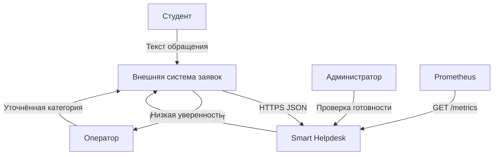
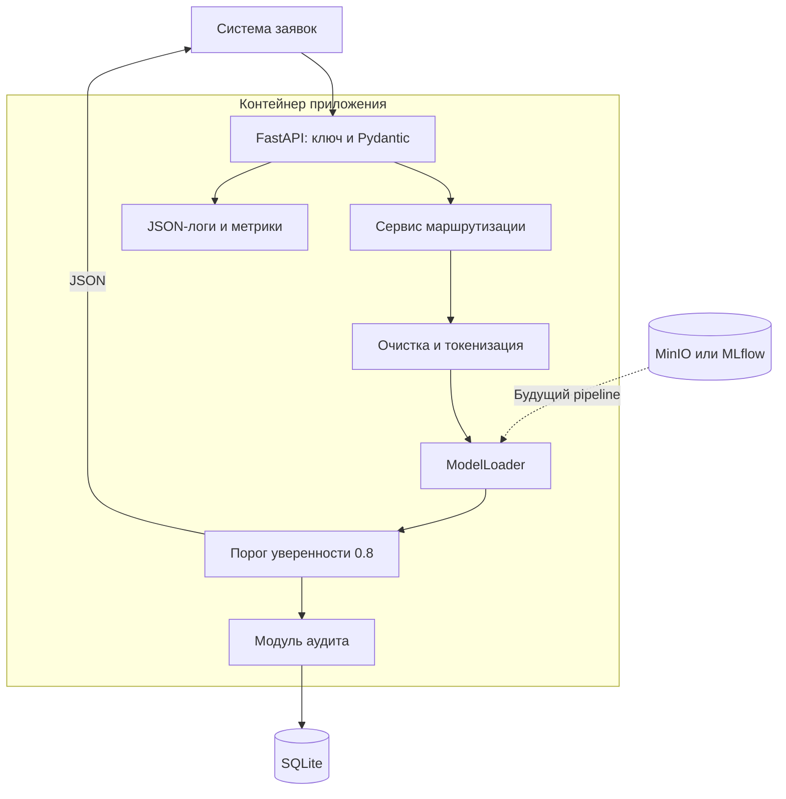

# Smart Helpdesk

Лабораторная работа № 2. Проектирование архитектуры программной AI-системы.

**Тема № 4: служба поддержки и умная маршрутизация обращений.**

Репозиторий: https://github.com/ovv20062009-afk/Smart-Helpdesk

## 1. Задача и требования

В службу поддержки учебного заведения поступают вопросы о доступе к личному кабинету, оплате и учёбе. Оператор читает их и выбирает отдел. Сервис должен автоматически определять категорию и предлагать маршрут. Если уверенность ниже 0,8, обращение передаётся оператору.

Пользователи: студент, оператор поддержки и администратор. Внешняя система заявок принимает обращения и назначает исполнителей. Сервис классификации возвращает ей решение; самостоятельная отправка сообщения сотруднику в каркасе не реализована.

Основные сценарии:
1. Студент отправляет текст через систему заявок.
2. Система заявок вызывает API и получает категорию, уверенность и отдел.
3. При достаточной уверенности система заявок назначает отдел.
4. При низкой уверенности оператор читает обращение и выбирает отдел вручную.
5. Администратор проверяет готовность сервиса и ошибки.

ML-задача — многоклассовая классификация текста (NLP). Категории: TECHNICAL, PAYMENT, STUDY, OTHER. Для первой обученной модели планируются TF-IDF и логистическая регрессия. Это небольшой CPU-проект, поэтому сложная языковая модель на первом этапе не нужна.

| Требование | Критерий |
|---|---|
| Принимать текст обращения | POST /api/v1/predict, JSON |
| Определять категорию и маршрут | Ответ содержит category, confidence, destination |
| Обрабатывать сомнительные прогнозы | confidence < 0.8 → OPERATOR |
| Проверять входные данные | Пустой текст, лишние поля и текст длиннее 5000 символов → 422 |
| Защищать прогноз ключом | Отсутствующий или неверный X-API-Key → 401 |
| Сохранять аудит | request_id, результат, версия и длина текста в SQLite |
| Проверять готовность | /health возвращает 200 или 503 |

Проектные цели, а не измеренные результаты: сократить первичную сортировку с 2 минут до 10 секунд; macro-F1 модели не ниже 0,85; точность автоматически направленных обращений не ниже 0,90; доля автоматической маршрутизации от 60%. Технические цели: p95 до 300 мс, 10 запросов/с, доступность 99,5%. Порог 0,8 проверяется на валидации с учётом ошибок и доли ручной обработки.

В систему входят API, обработка текста, классификация, правила маршрутизации, аудит и мониторинг. Ответ по существу вопроса, общение со студентом, выполнение платежей и работа сотрудников отделов находятся вне её границ.

**Статус ЛР 2:** реализован запускаемый каркас и заглушка модели по ключевым словам. Значения уверенности заглушки условные, качество ML на них оценивать нельзя. Обучение модели и внешние интеграции — следующие этапы.

## 2. Контекст системы



| Поток | Формат и протокол | Частота |
|---|---|---|
| Система заявок → API | HTTPS, JSON: ticket_id и text | При новом обращении |
| API → система заявок | HTTPS, JSON: категория, уверенность, отдел | Ответ на каждый запрос |
| Оператор → система заявок | Исправленная категория через её интерфейс | При ручной обработке |
| История заявок → обучение | Обезличенный CSV через защищённый экспорт | Раз в неделю |
| Prometheus → API | HTTP внутри закрытой сети, ответ OpenMetrics | Раз в 15 секунд |

## 3. Архитектура и компоненты

Выбран модульный монолит на FastAPI: одно приложение в Docker, разделённое на модули. Его проще запускать, тестировать и отлаживать. При необходимости независимого масштабирования модель можно вынести в отдельный сервис.



| Компонент | Ответственность |
|---|---|
| app/main.py | Маршруты, проверка ключа, готовность и метрики |
| app/api/schemas.py | Pydantic-схемы и ограничения |
| app/ml/preprocessing.py | Нижний регистр, обработка контактов, токены |
| app/ml/inference.py | Интерфейс загрузчика и заглушка классификации |
| app/services/prediction.py | Категория → отдел, fallback при confidence < 0.8 |
| app/repositories/audit.py | Журнал результатов SQLite |
| app/core и app/data | Каталоги для дальнейшего расширения конфигурации и обработки данных |

SQLite хранит результаты локального каркаса. При нескольких экземплярах приложения планируется PostgreSQL. MinIO/MLflow на диаграмме — запланированное хранилище обученного pipeline, пока оно не подключено.

## 4. REST API

### POST /api/v1/predict

Заголовки: Content-Type: application/json и X-API-Key: значение переменной API_KEY.

| Поле | Ограничение |
|---|---|
| ticket_id | 1–100 символов: латинские буквы, цифры, дефис, подчёркивание |
| text | Непустая строка до 5000 символов |

```json
{"ticket_id":"T-1","text":"Не могу войти, забыла пароль"}
```

Ответ заглушки (request_id генерируется заново):

```json
{
  "request_id": "ee36aa1a-8a64-4358-83bd-5c186ee93671",
  "ticket_id": "T-1",
  "category": "TECHNICAL",
  "confidence": 0.9,
  "destination": "IT_SUPPORT",
  "manual_review_required": false,
  "model_version": "stub-1.0.0"
}
```

Маршруты: TECHNICAL → IT_SUPPORT, PAYMENT → FINANCE, STUDY → STUDENT_OFFICE, OTHER → OPERATOR. Если confidence < 0.8, любой результат направляется в OPERATOR. При confidence = 0.8 автоматическая маршрутизация разрешена. Например, «Забыла пароль» получает условную уверенность 0.7 и ручную обработку, а «Не могу войти, забыла пароль» — 0.9 и IT_SUPPORT.

Ошибки: 401 — неверный ключ; 422 — неверные поля; 503 — не настроен API_KEY, не готова модель или недоступен журнал. Ответ валидации использует стандартный массив FastAPI detail с loc, msg и type. Полные схемы доступны по /docs.

### GET /health

Проверяет готовность заглушки, настройку API_KEY и соединение с SQLite. Возвращает 200 при готовности и 503 при проблеме. Проверка соединения не гарантирует наличие места для будущих записей.

```json
{"status":"healthy","model_loaded":true,"model_version":"stub-1.0.0","uptime_seconds":15.2}
```

### GET /metrics

OpenMetrics: http_requests_total, http_request_duration_seconds, model_inference_duration_seconds. Последняя метрика в каркасе охватывает вызов классификации и формирование результата, без записи в SQLite.

## 5. Потоки данных и жизненный цикл модели

Рабочий запрос: проверка ключа и схемы → очистка текста → токенизация → классификация → порог 0,8 → сохранение результата → JSON-ответ. Один request_id используется в ответе, HTTP-заголовке X-Request-ID, журнале запросов и базе.

Четыре контура:

1. **DataOps:** экспорт размеченных обращений, удаление дублей и персональных данных, проверка категорий. Датасеты CSV/Parquet хранятся в MinIO, версии — через DVC. Исходные обращения остаются во внешней системе с ограниченным доступом.
2. **MLOps:** разделение данных на обучение, валидацию и тест без одинаковых обращений в разных частях; обучение TF-IDF и классификатора; оценка macro-F1, precision по категориям и доли ручной обработки; проверка калибровки вероятностей. Pipeline сохраняется целиком в MinIO/MLflow.
3. **Serving:** FastAPI вызывает выбранную версию pipeline, возвращает уверенность и маршрут, сохраняет аудит. Сейчас его место занимает явно обозначенная заглушка.
4. **DevOps:** Docker задаёт окружение. GitHub Actions запускает тесты при push и pull request. Последующее развёртывание: сборка образа после успешных тестов, проверка /health, одобрение выпуска и откат к предыдущему образу при сбое.

Train-Serving Skew предотвращается общей обработкой текста и сохранением векторизатора с моделью как единого версионированного pipeline. Версия артефакта и контрольная сумма фиксируются в метаданных. Сервис загружает только доверенные артефакты.

## 6. Архитектурные решения

- [ADR-01](docs/adr/ADR-01.md): синхронный REST для одиночного обращения. Очередь понадобится при массовой обработке.
- [ADR-02](docs/adr/ADR-02.md): обученный pipeline хранится вне Git, код и метаданные — в Git.
- [ADR-03](docs/adr/ADR-03.md): модульный монолит для первой версии.

В документах указаны контекст, альтернативы, решение, обоснование и последствия.

## 7. Безопасность, мониторинг и дрейф

API_KEY задаётся через окружение и не записывается в Git или журнал. Pydantic ограничивает длину текста и отклоняет лишние поля. В SQLite сохраняются только результат и длина текста, исходный текст обращения не сохраняется. JSON-лог содержит время, request_id, маршрут, статус, задержку, категорию и версию модели.

Перед размещением в сети требуется reverse proxy с HTTPS, лимитом тела 2 МиБ, тайм-аутами и ограничением частоты запросов. Пример ограничений — deploy/nginx.conf; сертификат TLS настраивается отдельно. Локальный Uvicorn этих ограничений не обеспечивает. /metrics и аудит должны быть доступны во внутренней сети.

Для работы с персональными данными предусматриваются ограничение доступа, минимизация состава, срок хранения и удаление по установленным правилам с учётом 152-ФЗ. Регулярные выражения в каркасе заменяют email и похожие на телефоны последовательности, но не обеспечивают полное обезличивание: ФИО и другие сведения необходимо обрабатывать отдельно до обучения. В учебных примерах реальные персональные данные не используются.

Data Drift — изменение входных текстов: длины, словаря, тематики. Планируется еженедельный отчёт Evidently по обезличенной выборке: длина текста, доля неизвестных слов, распределения признаков; PSI или KS применяются к числовым признакам. Дополнительно отслеживаются confidence и доля ручной обработки.

Concept Drift — изменение связи текста с правильным отделом. После обратной связи операторов сравниваются macro-F1, precision и доля исправленных маршрутов. При ухудшении проводится проверка данных и переобучение. Новая модель не выпускается без валидации. Контроль дрейфа пока спроектирован, а не реализован.

## 8. Запуск и проверка

Нужен Python 3.12. В PowerShell из папки проекта:

```powershell
python -m venv .venv
.\.venv\Scripts\python.exe -m pip install -r requirements-dev.txt
$env:API_KEY = "local-demo-key"
.\.venv\Scripts\python.exe -m uvicorn app.main:app --reload
```

local-demo-key — открытый пример только для локального запуска; для внешнего сервера нужен собственный случайный ключ. Откройте http://127.0.0.1:8000/docs, выберите POST → Try it out, вставьте JSON из раздела 4, укажите ключ в x-api-key и нажмите Execute.

Проверка в другом окне PowerShell из той же папки:

```powershell
.\.venv\Scripts\python.exe -m pytest -q
```

Для Linux: создать venv, активировать через source .venv/bin/activate, установить requirements-dev.txt, задать export API_KEY=local-demo-key и запустить python -m uvicorn app.main:app --reload.

Docker после задания API_KEY:

```powershell
docker build -t smart-helpdesk .
docker run --rm -p 127.0.0.1:8000:8000 -e API_KEY -v helpdesk-data:/app/runtime smart-helpdesk
```

Локально 04.10.2026 прошли 16 тестов: категории и маршруты, низкая уверенность, граница 0,8, валидация, ключ, аудит без исходного текста, готовность, метрики и обработка контактов. Обучение модели, внешние интеграции, Docker-сборка и нагрузочные цели не проверялись. Workflow будет проверен после загрузки на GitHub.
